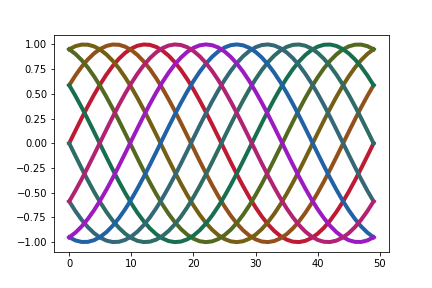

# munspace

## Utility for using rgb colors that approximate the Munsell color space in Python.

To use these:

1.  Clone the repository or copy the files (at minimum) `munspace.py` and 
    `munsell_chips.csv` to your working directory.
2.  In your Python file include `import munspace` or `from munspace import hvc`
3.  `munspace.hvc` has the following signature:

        hvc(h, v = 5, c = 'middle'):
        """
        returns rbg hex string of 'high', 'middle' or 'low' chroma=c for munsell
        h=hue, v=value.

        defaults to 'middle' chroma.
        """
    Hues available will be in the list `hues`, values run from 1 to 9,
    and simple chroma ranges are from `['low', 'middle', 'high']`
    
Note that these will only be approximations, and will depend on the 
color temperature of your display, etc.

<figure>

<figcaption>Sine waves in Munsell primary and secondary colors, medium chroma
and value.</figcaption>
</figure>

I was led to the RGB values used by Andrew Werth's very nice
[Virtual Munsell Color Wheel](https://www.andrewwerth.com/aboutmunsell/) and the
Javascript there.

This uses the **Munsell Renotation Data** from:
<https://www.rit.edu/cos/colorscience/rc_munsell_renotation.php>

I have downloaded the files from there: `all.dat` `real.dat` and 
associated `.xlsx` files. I include the text from there in a description file.
